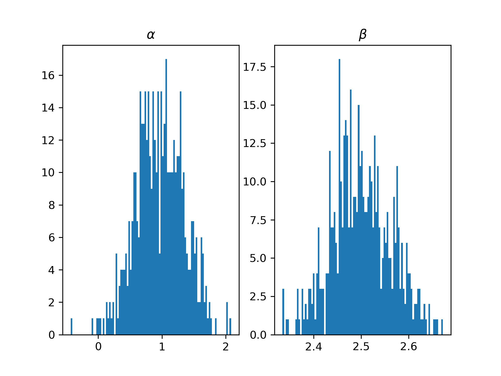
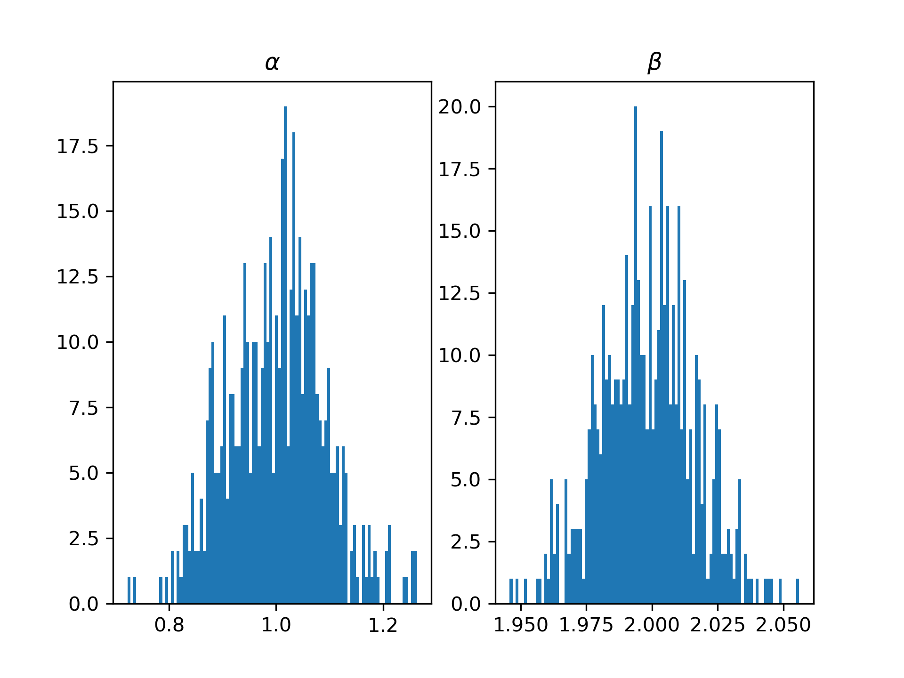

### 第一部分

#### 1. 拟合样本$Y_1, \cdots, Y_n; X_1, \cdots, X_n$

**（a）**OLS推到过程及$\hat{\beta}$

根据最小平方误差估计的思想要最小化一下平方误差：
$$
\sum_{i = 1}^{n} (Y_i - \alpha - \beta X_i)^2
$$
对该误差项求导，并且联立方程使其等于零得到如下方程：
$$
\begin{cases}
\sum_{i = 1}^n(Y_i - \hat{\alpha} - \hat{\beta} X_i) = 0\\
\sum_{i = 1}^n X_i(Y_i - \hat{\alpha} - \hat{\beta} X_i) = 0
\end{cases}
$$
化简上述方程得到解如下：
$$
\hat{\beta} = \frac{\sum_{i = 1}^n (X_i - \bar{X})(Y_i - \bar{Y})}{\sum_{i = 1}^n(X_i - \bar{X})^2}\\
\hat{\alpha} = \bar{Y} - \hat{\beta}\bar{X}
$$
计算$\hat{\beta}$方差如下
$$
\begin{aligned}
Var(\hat{\beta}) &= \frac{1}{(\sum_{i = 1}^n (X_i - \bar{X})^2)^2}Var(\sum_{i = 1}^n (X_i - \bar{X})u_i)\\
&=\frac{1}{SST_x^2} \sum_{i = 1}^n(X_i - \bar{X})^2Var(u_i)\\
&=\frac{\sigma^2}{SST_x} 
\end{aligned}
$$
**（b）**使用最大似然估计

对线性模型$Y = \alpha + \beta X + u$使用最大似然估计，先计算出似然函数如下：
$$
\begin{aligned}
lr &= \sum_{i = 1}^n f(Y_i | \alpha, \beta, X_i)\\
\end{aligned}
$$
去对数似然函数$llr$并且对参数$\alpha, \beta$求导如下：
$$
\frac{\partial llr}{\partial \alpha} = \frac{1}{\sigma^2}\sum_{i = 1}^n (Y_i - \alpha - \beta X_i) = 0\\
\frac{\partial llr}{\partial \beta} = \frac{1}{\sigma^2} \sum_{i = 1}^n (Y_i - \alpha - \beta X_i)X_i = 0
$$
求解和OLS估计结果相同。


**（c）**OLS性质

* 线性特性
* 无偏性
* 方差最小

**（d）**忽略影响因素Z

忽略影响因素Z会产生内生性问题，导致模型估计没有一致性。


### 第二部分

#### 1. 拟合股票收益率

在[网站](https://www.investing.com/)上下载2022年9月26日及之前34天的上证指数和601666（平煤股份）的收益率。并且根据下载下来的数据做回归模型$lnY = \alpha + \beta ln X + \mu$

**（a）**估算$\alpha$和$\beta$

使用python对$\alpha$和$\beta$进行拟合拟合的结果如下


其中$\alpha$和$\beta$的拟合结果为：
$$
\begin{cases}
\alpha = 0.002881\\
\beta = 2.07210001
\end{cases}
$$


**（b）**检验$\alpha$和$\beta$是否为零$t$统计量大小，及其$p$值大小以及$95%$的置信区间。

在Python中可以使用```statsmodels```库对统计量进行OLS估计平且给出各个统计量的值。根据该工具的输出得到结果如下：
$$
\begin{cases}
t_\alpha = 1.115\\
p_\alpha =  0.274\\
CI_\alpha = [-0.002, 0.008]

\end{cases}
\quad
\begin{cases}
t_\beta = 2.777\\
p_\beta = 0.010\\
CI_\beta = [0.544, 3.601]
\end{cases}
$$
```statsmodels```库的输出如下：

```
                            OLS Regression Results
==========================================================================
Dep. Variable:                      y   R-squared:                   0.216
Model:                            OLS   Adj. R-squared:              0.188
Method:                 Least Squares   F-statistic:                 7.711
Date:                Tue, 27 Sep 2022   Prob (F-statistic):        0.00968
Time:                        19:58:17   Log-Likelihood:             87.592
No. Observations:                  30   AIC:                        -171.2
Df Residuals:                      28   BIC:                        -168.4
Df Model:                           1
Covariance Type:            nonrobust
==========================================================================
                 coef    std err          t      P>|t|      [0.025  0.975]
--------------------------------------------------------------------------
const          0.0029      0.003      1.115      0.274      -0.002   0.008
x1             2.0721      0.746      2.777      0.010       0.544   3.601
==========================================================================
Omnibus:                        0.273   Durbin-Watson:               2.074
Prob(Omnibus):                  0.872   Jarque-Bera (JB):            0.461
Skew:                           0.056   Prob(JB):                    0.794
Kurtosis:                       2.403   Cond. No.                     302.
==========================================================================
```

**（c）**对$\alpha = 0$进行F检验

得到F值为$1.24$，p值为$0.27$


**（d）**使用线性模型估计后四天的股价

根据1-30天的线性模型估算31-34天的收益率，收益率的差距为$-1.7\%, 3.4\%, 1.1\%, -1.5\%$（已根据对数调整）。为了方便观察，将预测的目标点以红色标识出来，模型预测结果比如落在回归的曲线上因此无需另外标注。


#### 2. Monte Carlo 模拟

用线性模型$Y =\alpha + \beta X + u$进行OLS估计

**（a）**生成式为$Y = 1 + 2X + u$

​	进行500次估计$\bar{\alpha} = 0.98327195, \bar{\beta} = 1.99997743$。计算$\hat{\beta}$方差的均值为$0.0008705964458646255$

其分布如下：


**（b）**生成式为$Y_1 = 1+2X+X_2+u$，其中$X_2 = 0.5X+u$

进行500次估计$\bar{\alpha} = 0.96488324, \bar{\beta} = 2.5006425$。计算$\hat{\beta}$方差的均值为$0.00347362784688476$。其分布如下：



**（c）**生成式为$Y_2 = 1 + 2X + u_2$，其中$u_{2i} = 0.4 × u_{2,i−1} + \epsilon_i$，$\epsilon \in N(0, 1)$

进行500次估计$\bar{\alpha} = 1.00091964, \bar{\beta} = 1.99842612$，计算$\hat{\beta}$方差的均值为$8.44591277699496e-05$。其分布如下：


